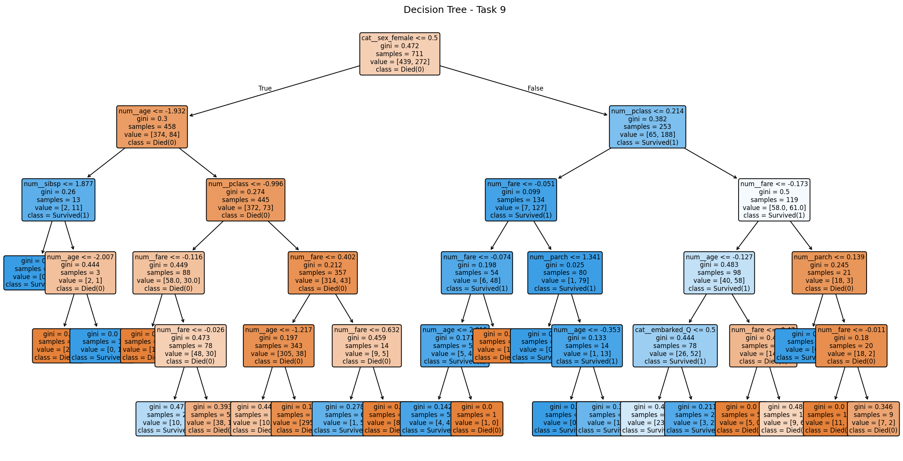
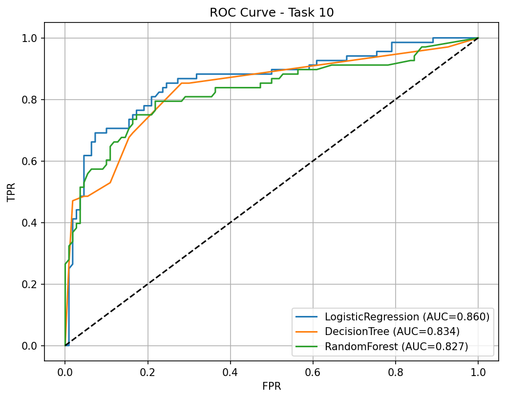
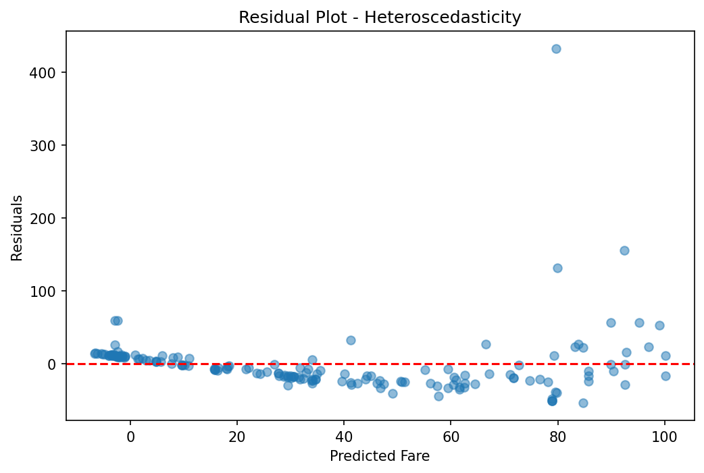

# Masai-Project - Titanic Part B

## Plots - Task 9, 10, 13
These are saved from 02_modelling.ipynb

### Task 9 - Decision Tree

### Task 10 - ROC Curve Comparison

### Task 13 - Residual Plot - Heteroscedasticity

## File Structure
- `02_modelling.ipynb` - Tasks 7-15 with justifications (single copy, valid)
- `analytics/titanic_cleaned.csv`
- `analytics/best_titanic_pipeline.pkl`

## Justifications
- Task 7: Stratified split preserves 38% survived ratio
- Task 8: Pipeline prevents leakage
- Task 11: SMOTE train-only via ImbPipeline
- Task 12: oob_score=True at construction
- Task 13: Heteroscedasticity fan shape
- Task 15: Full Pipeline saved via joblib
